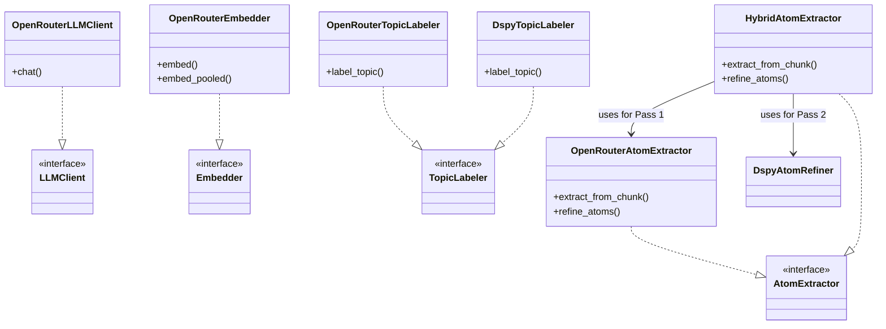
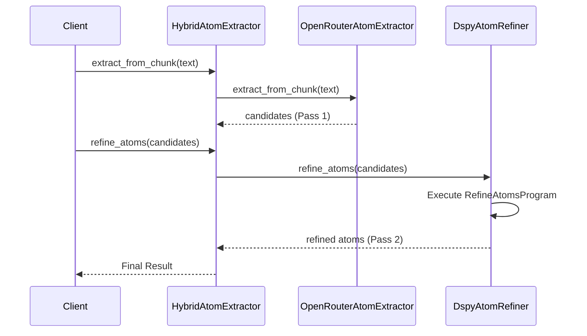

# ck_exporter-adapters Module Documentation

The `ck_exporter-adapters` module provides concrete implementations (adapters) for the ports defined in the `ck_exporter-core` module. It integrates external services and libraries—specifically OpenRouter for LLM/Embedding APIs and DSPy for structured programming—to fulfill the system's requirements for knowledge extraction, embedding, and topic labeling.

## Architecture

This module follows the Hexagonal Architecture (Ports and Adapters) pattern. It implements the interfaces defined in the core domain, isolating external dependencies from the business logic.

## Core Components

### 1. LLM Client Adapter
**Component**: `src.ck_exporter.adapters.openrouter_llm.OpenRouterLLMClient`

Implements the `LLMClient` interface using the OpenRouter API (compatible with OpenAI client).

*   **Key Features**:
    *   **Concurrency Control**: Uses a global semaphore (`CKX_MAX_CONCURRENCY`) to limit in-flight requests.
    *   **Resilience**: Implements retries with exponential backoff using `tenacity`.
    *   **JSON Mode**: Supports structured JSON output enforcement.

### 2. Embedder Adapter
**Component**: `src.ck_exporter.adapters.openrouter_embedder.OpenRouterEmbedder`

Implements the `Embedder` interface for generating vector embeddings.

*   **Key Features**:
    *   **Batching**: Automatically batches requests to the API.
    *   **Caching**: Caches embeddings to disk to avoid redundant API calls.
    *   **Pooling**: Implements `embed_pooled` to handle long documents by chunking, embedding, and applying normalized mean pooling.
    *   **Model**: Defaults to `openai/text-embedding-3-small`.

### 3. Atom Extraction Adapters

The module provides strategies for extracting "atoms" (facts, decisions, open questions) from conversations.

#### OpenRouter Atom Extractor
**Component**: `src.ck_exporter.adapters.openrouter_atom_extractor.OpenRouterAtomExtractor`

A pure prompt-based implementation using direct LLM calls.

*   **Process**:
    1.  **Pass 1 (Extraction)**: Extracts candidates from individual chunks using a fast model. Includes logic to repair malformed JSON.
    2.  **Pass 2 (Refinement)**: Consolidates and deduplicates candidates using a larger model.

#### Hybrid Atom Extractor
**Component**: `src.ck_exporter.adapters.hybrid_atom_extractor.HybridAtomExtractor`

Combines the reliability of prompt-based extraction for chunks with the structured power of DSPy for refinement.

*   **Workflow**:
    *   **Pass 1**: Delegates to `OpenRouterAtomExtractor` (uses standard prompts).
    *   **Pass 2**: Delegates to `DspyAtomRefiner` (uses DSPy program).

#### DSPy Atom Refiner
**Component**: `src.ck_exporter.adapters.dspy_atom_refiner.DspyAtomRefiner`

Uses [DSPy](https://dspy.ai/) to programmatically refine and consolidate atoms.

*   **Logic**: Uses `RefineAtomsProgram` to process candidate JSON and output structured lists of facts, decisions, and questions.

### 4. Topic Labeling Adapters

Adapters for generating human-readable names and descriptions for topic clusters.

*   **OpenRouterTopicLabeler**: Uses a direct prompt with representative documents to generate a JSON label.
*   **DspyTopicLabeler**: Uses a DSPy `ChainOfThought` signature (`LabelTopic`) to generate the label.

## DSPy Programs

The module defines DSPy signatures and modules in `src.ck_exporter.programs.dspy`.

### Label Topic Program
**File**: `src/ck_exporter/programs/dspy/label_topic.py`

*   **Signature**: `LabelTopic`
    *   **Inputs**: `representative_docs`, `keywords`
    *   **Outputs**: `name`, `description`
*   **Module**: `LabelTopicProgram` uses Chain-of-Thought to improve reasoning before generating the label.

### Refine Atoms Program
**File**: `src/ck_exporter/programs/dspy/refine_atoms.py`

*   **Signature**: `RefineAtoms`
    *   **Inputs**: `conversation_id`, `conversation_title`, `candidates_json`
    *   **Outputs**: `facts_json`, `decisions_json`, `open_questions_json`
*   **Module**: `RefineAtomsProgram` processes the raw candidates into clean, deduplicated lists.

## Dependencies

*   **[ck_exporter-core](ck_exporter-core.md)**: Provides the port interfaces.
*   **OpenAI SDK**: Used to communicate with OpenRouter.
*   **DSPy**: Used for structured programming and optimization of prompts.
*   **Tenacity**: For retry logic.
*   **NumPy**: For vector operations in the Embedder.
