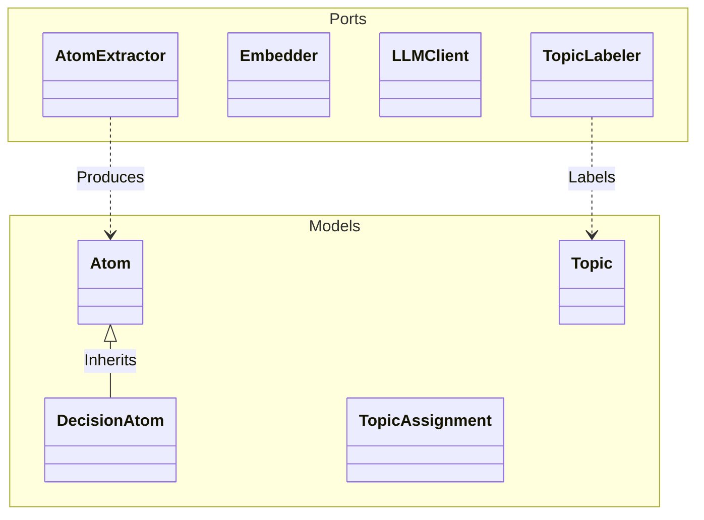
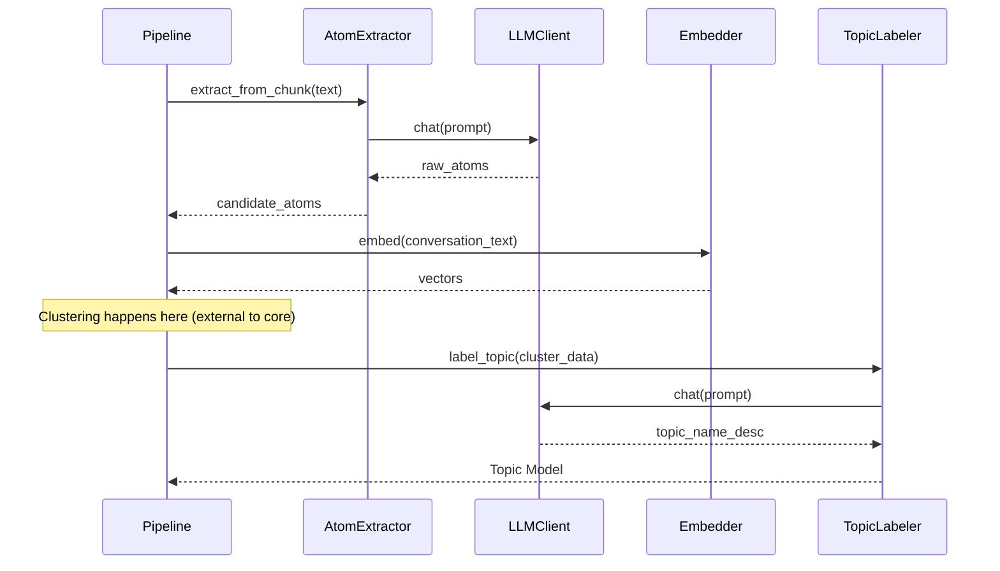

# ck_exporter-core Module Documentation

## Introduction

The `ck_exporter-core` module serves as the foundational domain layer of the system. Following the **Hexagonal Architecture** (Ports and Adapters) pattern, it defines the core data models (Entities) and the interfaces (Ports) that drive the application's business logic.

This module is designed to be:
- **Framework-agnostic**: Pure Python with minimal dependencies.
- **Decoupled**: Defines *what* needs to be done (Ports) without defining *how* (Adapters).
- **Centralized**: Contains the canonical definitions for Knowledge Atoms and Topics.

## Architecture

The core module sits at the center of the application. It defines the data structures (`Models`) that flow through the system and the interfaces (`Ports`) that external adapters must implement.

## Core Models

The domain models represent the fundamental data structures of the knowledge extraction system.

### Knowledge Atoms (`src.ck_exporter.core.models.atoms`)

Atoms are the granular units of knowledge extracted from conversations.

#### `Atom`
The base class for all knowledge atoms.

| Field | Type | Description |
|-------|------|-------------|
| `type` | `Literal` | Type of atom (e.g., "fact", "requirement", "idea"). |
| `topic` | `str` | The category or topic this atom belongs to. |
| `statement` | `str` | The core knowledge statement. |
| `status` | `str` | Status of the atom ("active", "deprecated", "uncertain"). |
| `evidence` | `List[Evidence]` | Links back to the source message(s). |

#### `DecisionAtom`
A specialized atom representing a decision made during a conversation. Inherits from `Atom`.

| Field | Type | Description |
|-------|------|-------------|
| `alternatives` | `List[str]` | Options that were considered but not chosen. |
| `rationale` | `Optional[str]` | The reasoning behind the decision. |
| `consequences` | `Optional[str]` | Expected outcomes or side effects. |

#### `OpenQuestion`
Represents an unresolved question or uncertainty identified in the conversation.

| Field | Type | Description |
|-------|------|-------------|
| `question` | `str` | The question itself. |
| `context` | `Optional[str]` | Additional context to understand the question. |

### Topics (`src.ck_exporter.core.models.topics`)

Models related to the discovery and assignment of topics to conversations.

#### `Topic`
Represents a discovered cluster of related content.

| Field | Type | Description |
|-------|------|-------------|
| `topic_id` | `int` | Unique numeric identifier. |
| `name` | `str` | Short, descriptive name (3-5 words). |
| `description` | `str` | Detailed description (1-2 sentences). |
| `keywords` | `List[str]` | Representative terms for the topic. |
| `centroid_embedding` | `List[float]` | Vector representation of the topic center. |

#### `TopicAssignment`
Links a specific conversation to a topic with a relevance score.

| Field | Type | Description |
|-------|------|-------------|
| `topic_id` | `int` | ID of the assigned topic. |
| `score` | `float` | Cosine similarity score (0.0 - 1.0). |
| `rank` | `Literal` | "primary" or "secondary" classification. |

## Port Interfaces

Ports define the contracts for external services. Adapters in other modules (e.g., `ck_exporter-adapters`) implement these interfaces.

### `AtomExtractor` (`src.ck_exporter.core.ports.atom_extractor`)
**Responsibility**: Extract structured knowledge atoms from raw conversation text.

*   `extract_from_chunk(chunk_text: str) -> dict`:
    *   **Pass 1**: Extracts candidate facts, decisions, and questions from a text chunk.
*   `refine_atoms(all_candidates, conversation_id, ...) -> dict`:
    *   **Pass 2**: Consolidates, deduplicates, and refines the candidate atoms across the entire conversation.

### `Embedder` (`src.ck_exporter.core.ports.embedder`)
**Responsibility**: Convert text into vector embeddings for semantic search and clustering.

*   `embed(texts: list[str]) -> np.ndarray`:
    *   Generates embeddings for a list of strings.
*   `embed_pooled(texts, ...) -> np.ndarray`:
    *   Handles long texts by chunking, embedding, and pooling (averaging) the vectors.

### `LLMClient` (`src.ck_exporter.core.ports.llm`)
**Responsibility**: Abstract interaction with Large Language Models (e.g., OpenAI, Anthropic).

*   `chat(model, system, user, ...) -> str`:
    *   Sends a chat completion request. Supports JSON mode enforcement.

### `TopicLabeler` (`src.ck_exporter.core.ports.topic_labeler`)
**Responsibility**: Generate human-readable labels for discovered topic clusters.

*   `label_topic(topic_id, representative_docs, keywords) -> dict`:
    *   Analyzes representative documents and keywords to generate a `name` and `description` for the topic.

## Component Interaction

The core components work together to transform raw conversations into structured knowledge.

## References

*   **Adapters**: Implementations of these ports can be found in the [ck_exporter-adapters](ck_exporter-adapters.md) module.
*   **Pipeline**: The orchestration of these components is handled in the [ck_exporter-pipeline](ck_exporter-pipeline.md) module.
