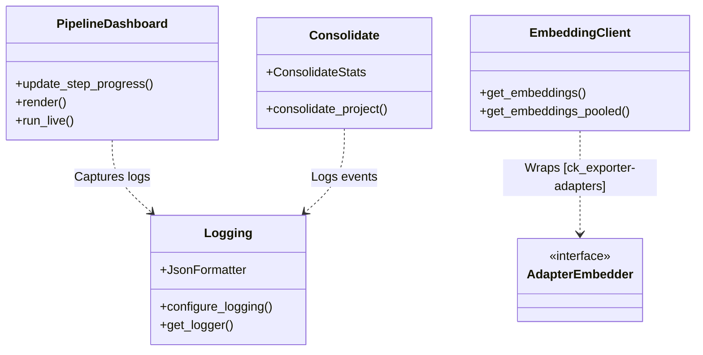
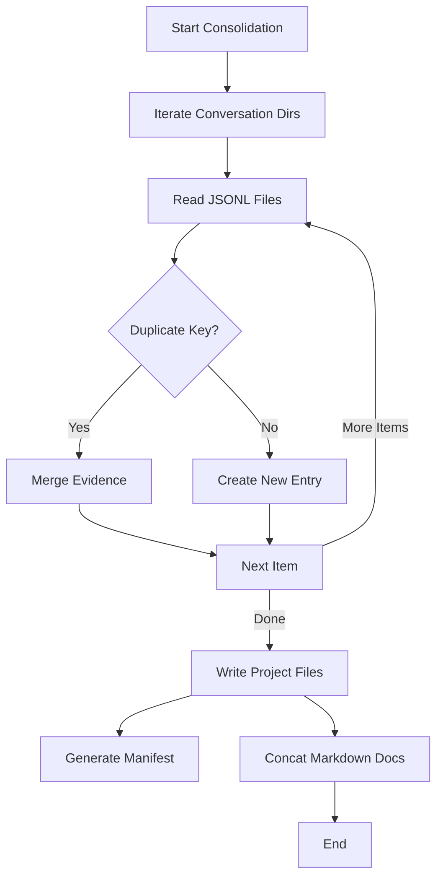

# ck_exporter-pipeline Module Documentation

The `ck_exporter-pipeline` module provides the core infrastructure and final processing steps for the knowledge extraction system. It encompasses the consolidation logic that merges per-conversation data into a project-wide knowledge base, a unified logging system, a terminal dashboard for progress tracking, and embedding client utilities.

## Overview

This module serves as the backbone for the execution and output generation of the extraction process. It ensures that data extracted from individual conversations is correctly aggregated, deduplicated, and formatted for the final output. Additionally, it provides the user interface (CLI dashboard) and logging mechanisms used throughout the application lifecycle.

## Architecture

The module consists of four main functional areas:

1.  **Consolidation**: Merges distributed conversation outputs into a single coherent knowledge packet.
2.  **Logging**: A centralized logging configuration supporting structured JSON logs and human-readable console output.
3.  **UI/Dashboard**: A `rich`-based terminal dashboard for real-time progress monitoring.
4.  **Embeddings**: A compatibility layer for embedding operations, wrapping adapters.



## Core Components

### 1. Consolidation (`src.ck_exporter.pipeline.consolidate`)

The consolidation component is responsible for the final stage of the pipeline: aggregating extracted information from multiple conversations into a project-level dataset.

#### Key Features
-   **Deduplication**: Identifies identical atoms, decisions, and questions across different conversations.
-   **Evidence Merging**: When duplicates are found, their evidence (source references) is merged to show all occurrences.
-   **Manifest Generation**: Creates a summary `manifest.md` detailing the statistics of the extraction.
-   **Documentation Concatenation**: Optionally merges markdown documentation and ADRs into single files.

#### Process Flow



#### Data Structures
-   **Atoms Key**: `(type, topic, statement)`
-   **Decisions Key**: `(type, topic, statement)`
-   **Questions Key**: `(topic, question)`

### 2. Logging (`src.ck_exporter.logging`)

Provides a flexible logging system that adapts to the execution environment (interactive vs. automated).

#### Modes
-   **Human**: Uses `rich` for colorful, readable console output. Default for TTY.
-   **Machine**: Outputs structured JSON logs to a file or stderr. No console formatting.
-   **Hybrid**: Displays `rich` console output while simultaneously writing JSON logs to a file.

#### Configuration
```python
from ck_exporter.logging import configure_logging

# Example: Hybrid mode with file output
configure_logging(
    level="INFO",
    log_file=Path("pipeline.log"),
    mode="hybrid"
)
```

### 3. User Interface (`src.ck_exporter.ui.dashboard`)

A persistent terminal dashboard built with `rich`. It visualizes the pipeline's progress, showing step status, progress bars, and a tail of recent logs.

#### Features
-   **Step Tracking**: Monitors status (pending, running, complete, error) for defined pipeline steps.
-   **Progress Bars**: Visual feedback for long-running tasks.
-   **Log Integration**: Captures and displays recent log messages in a dedicated panel without disrupting the UI layout.
-   **Performance Metrics**: Tracks elapsed time and processing rates.

### 4. Embeddings (`src.ck_exporter.embeddings`)

A wrapper client for embedding operations. It ensures backward compatibility while delegating the actual work to the `ck_exporter-adapters` module.

-   **Class**: `EmbeddingClient`
-   **Delegates to**: `src.ck_exporter.adapters.openrouter_embedder.OpenRouterEmbedder`
-   **Functionality**: Provides standard and pooled embedding generation.

## Dependencies

-   **[ck_exporter-adapters](ck_exporter-adapters.md)**: The `EmbeddingClient` relies on the OpenRouter adapter for actual API calls.
-   **Rich**: Used extensively for the Dashboard and Human logging mode.

## Usage Examples

### Running Consolidation

```python
from pathlib import Path
from ck_exporter.pipeline.consolidate import consolidate_project

stats = consolidate_project(
    atoms_dir=Path("./output/conversations"),
    docs_dir=Path("./output/docs"),
    out_dir=Path("./output"),
    include_docs=True
)

print(f"Consolidated {stats.atoms_out} atoms.")
```

### Using the Dashboard

```python
from ck_exporter.ui.dashboard import PipelineDashboard
import time

dashboard = PipelineDashboard(steps=["Extract", "Consolidate"])

with dashboard.run_live():
    # Step 1
    dashboard.set_step_status("Extract", "running")
    dashboard.set_step_total("Extract", 100)
    for i in range(100):
        dashboard.update_step_progress("Extract", i + 1)
        time.sleep(0.01)
    dashboard.set_step_status("Extract", "complete")
    
    # Step 2
    dashboard.set_step_status("Consolidate", "running")
    # ... logic ...
    dashboard.set_step_status("Consolidate", "complete")
```
