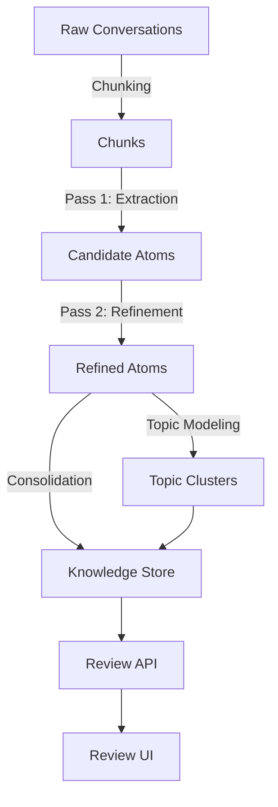

# ChatGPT Conversation Knowledge Exporter

## Introduction

The **ChatGPT Conversation Knowledge Exporter** (`ck_exporter`) is a modular system designed to extract, refine, organize, and export structured knowledge from conversation logs (specifically ChatGPT exports). It transforms raw conversation text into "Knowledge Atoms" (facts, decisions, open questions) and organizes them into discovered topics.

The system follows a **Hexagonal Architecture (Ports and Adapters)** pattern, ensuring separation between the core domain logic (models, ports) and external dependencies (LLM providers, embedding services, storage).

## System Architecture

The system consists of three main parts:

1.  **Core Exporter (`ck_exporter`)**: The Python library responsible for the extraction pipeline.
2.  **Review API (`review-api`)**: A backend service to browse, search, and bundle the extracted knowledge.
3.  **Review UI (`review-ui`)**: A frontend interface for human review (TypeScript definitions provided).

### High-Level Data Flow

## Sub-Modules

### 1. Core Domain & Ports
Defines the fundamental data structures (Atoms, Topics) and interfaces (Ports) that the system uses. This ensures the core logic is independent of specific LLM providers.
- [Core Documentation](ck_exporter-core.md)

### 2. Adapters
Implementations of the core ports. This includes adapters for OpenRouter (LLM, Embeddings) and DSPy (Refinement, Labeling).
- [Adapters Documentation](ck_exporter-adapters.md)

### 3. Pipeline & Utilities
Components that orchestrate the data flow, handle logging, and manage the CLI dashboard.
- [Pipeline Documentation](ck_exporter-pipeline.md)

### 4. Review API
The backend service that loads the generated knowledge artifacts, provides search capabilities, and handles export bundling.
- [Review API Documentation](review-api.md)

## Key Concepts

### Knowledge Atoms
The fundamental unit of extracted information.
- **Facts**: Verifiable statements extracted from the text.
- **Decisions**: Choices made during the conversation, including rationale and alternatives.
- **Open Questions**: Unresolved uncertainties or follow-up items.

### Topic Discovery
The system clusters conversations based on semantic similarity (using embeddings) to discover latent topics. These topics are then labeled using an LLM.

### Two-Pass Extraction
1.  **Pass 1 (Fast)**: Extracts raw candidates from individual chunks using a faster/cheaper model.
2.  **Pass 2 (Refinement)**: Consolidates, deduplicates, and refines candidates using a stronger model (often using DSPy for optimization).
