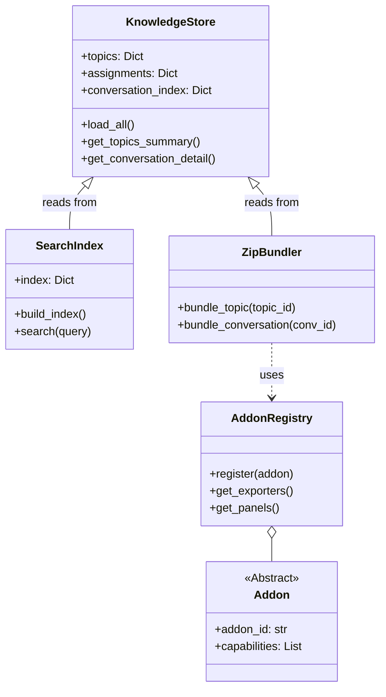
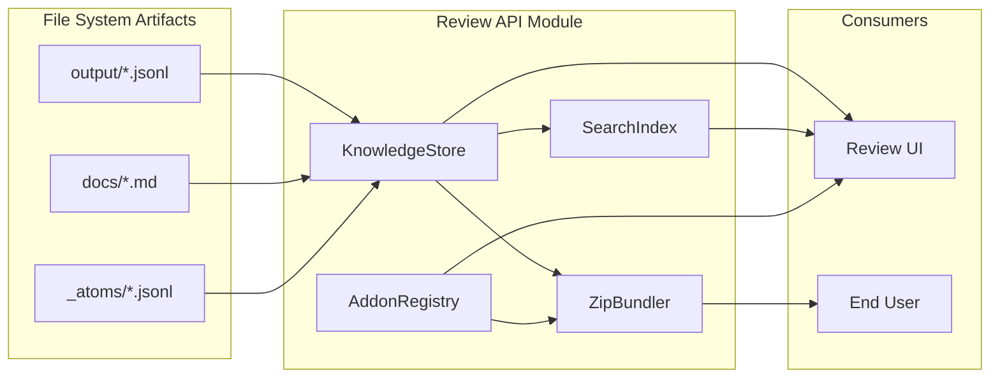

# Review API Module Documentation

The `review-api` module provides a read-only API layer and data management system for the Knowledge Review Interface. It serves as the bridge between the static knowledge artifacts generated by the `ck_exporter` pipeline and the interactive Review UI.

## Overview

The primary purpose of this module is to load, index, and serve the structured knowledge data (topics, conversations, atoms, documents) produced by the extraction pipeline. It offers capabilities for:

- **Data Loading**: Efficiently loading and indexing JSON/JSONL artifacts from the file system.
- **Search**: Full-text search across all knowledge assets.
- **Bundling**: Generating downloadable ZIP bundles for offline analysis or distribution.
- **Extensibility**: An addon system for custom exports and UI panels.

## Architecture

The module is built around a central `KnowledgeStore` that manages the in-memory state of the knowledge base.



### Core Components

#### 1. KnowledgeStore
**Location**: `apps.review-api.src.review_api.store.KnowledgeStore`

The `KnowledgeStore` is the data access layer. It initializes by scanning a specific directory structure (containing `output/`, `docs/`, `_atoms/`, etc.) and builds in-memory indexes for fast retrieval.

*   **Data Sources**:
    *   `topic_registry.json`: Definitions of identified topics.
    *   `assignments.jsonl`: Mapping of conversations to topics.
    *   `review_queue.jsonl`: Items flagged for manual review.
    *   `_atoms/` & `project/`: Extracted atoms (facts, decisions, questions).
    *   `docs/`: Markdown documentation and ADRs.

*   **Key Responsibilities**:
    *   Aggregating statistics (atom counts, conversation counts).
    *   Resolving file paths for specific conversations.
    *   Handling fallback logic (e.g., loading atoms from consolidated files if per-conversation files are missing).

#### 2. SearchIndex
**Location**: `apps.review-api.src.review_api.search.SearchIndex`

Provides a lightweight, in-memory full-text search engine.

*   **Indexing**: It iterates through the `KnowledgeStore` data and indexes:
    *   Topic names, descriptions, and keywords.
    *   Conversation titles and project names.
    *   Individual atoms (statements, rationales, questions).
    *   Markdown document content.
*   **Search**: Performs word-frequency based scoring to return ranked results categorized by type (Topic, Conversation, Atom, Doc).

#### 3. ZipBundler
**Location**: `apps.review-api.src.review_api.bundler.ZipBundler`

Handles the generation of downloadable artifacts. It creates ZIP files containing all relevant data for a specific context (Conversation or Topic).

*   **Conversation Bundle**: Includes the manifest, source documents, ADRs, extracted atoms (JSONL), and evidence files.
*   **Topic Bundle**: Aggregates bundles for all primary conversations associated with the topic.
*   **Integration**: Uses the `AddonRegistry` to include custom generated files (e.g., CSV exports, summaries) in the bundle.

#### 4. Addon System
**Location**: `apps.review-api.src.review_api.addons`

Allows extending the API's functionality without modifying core logic.

*   **Types of Addons**:
    *   `ExporterAddon`: Generates additional files to be included in ZIP bundles (e.g., `AtomsCSVExporter`, `TopicBriefExporter`).
    *   `PanelAddon`: Provides data for custom UI panels in the frontend (e.g., `TopicStatsPanel`).
*   **Registry**: `AddonRegistry` manages the lifecycle and discovery of these addons.

## Data Flow

The following diagram illustrates how data flows from the file system through the API components to the consumer.



## Data Models

The module relies on data schemas defined in [ck_exporter-core](ck_exporter-core.md). It also defines specific structures for the UI and Bundles.

### UI Types
Defined in `apps/review-ui/src/types.ts`, these interfaces represent the data contract with the frontend:
*   `TopicSummary`: High-level stats for the topic list.
*   `TopicDetail`: Detailed view including representative conversations.
*   `ConversationDetail`: Full conversation view with atoms and documents.
*   `ReviewQueueItem`: Items requiring human attention.

### Bundle Manifest
When `ZipBundler` creates a package, it includes a `manifest.json`:
```json
{
  "kind": "conversation|topic",
  "conversation_id": "...",
  "title": "...",
  "topics": [...],
  "generated_at": "ISO8601"
}
```

## Usage Examples

### Initializing the Store
```python
from pathlib import Path
from review_api.store import KnowledgeStore
from review_api.search import SearchIndex

# Initialize store with the root path of the generated data
store = KnowledgeStore(Path("./data_root"))

# Initialize and build search index
search_index = SearchIndex(store)
search_index.build_index()
```

### Generating a Bundle
```python
from review_api.bundler import ZipBundler

bundler = ZipBundler(store)

# Get bytes for a conversation zip
zip_bytes = bundler.bundle_conversation("conv-123")

# Get bytes for a topic zip
topic_zip_bytes = bundler.bundle_topic(1)
```

## Dependencies

*   **[ck_exporter-core](ck_exporter-core.md)**: Provides the fundamental data models (`Atom`, `Topic`, `TopicAssignment`) used throughout the store.
